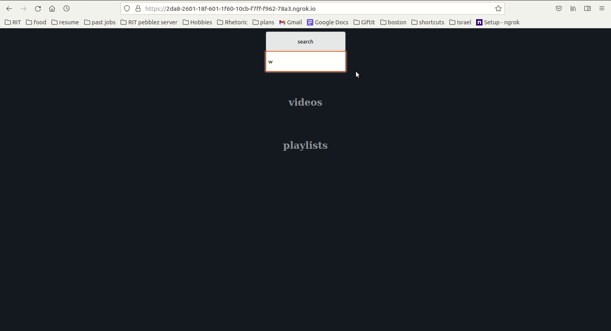

# Ad Free Youtube
This project explores the use of youtube's embed architecture to circumvent ads
<p align="center">

</p>

## Quickstart
```bash
# Get this project
git clone https://github.com/BarakBinyamin/addless-youtube.git
cd addless-youtube
npm install
# Run the demo @ localhost:8000
node index.js --port=8000
```

## Avoid CORS policy blocks
If you try to use your ip address instead of localhost you'll most likely have [CORS](https://developer.mozilla.org/en-US/docs/Web/HTTP/CORS) issues

You can get an ssl encrytpted (https) tunnel to internet with the awesome tool [localhost.run](https://localhost.run/)
```bash
ssh -R 80:localhost:8000 nokey@localhost.run
```

CORS, cross origin resource sharing, is a set of browser policies meant to keep your data safe. One of these policies prevents requests to ssl secured (https) websites from a non secure website (http). Special acception for localhost becuase that's known to be your computer.

## Or Ngrok
Forward this service to the web using ngrok, and avoid CORS policy blocks
1. [Make an ngrok account](https://ngrok.com/)
2. Create an ssh key with the command `ssh-keygen`
   1. Follow the prompts, remember the passphrase 
   2. Copy the public key (cat /path/to/id_rsa.pub)
3. [Paste the ssh key to ngrok](https://dashboard.ngrok.com/tunnels/ssh-keys)
4. Forward this service to the web
```bash
ssh -i id_rsa -R 443:localhost:8000 tunnel.us.ngrok.com http
```
The output should be two routes, one with ssl enabled
