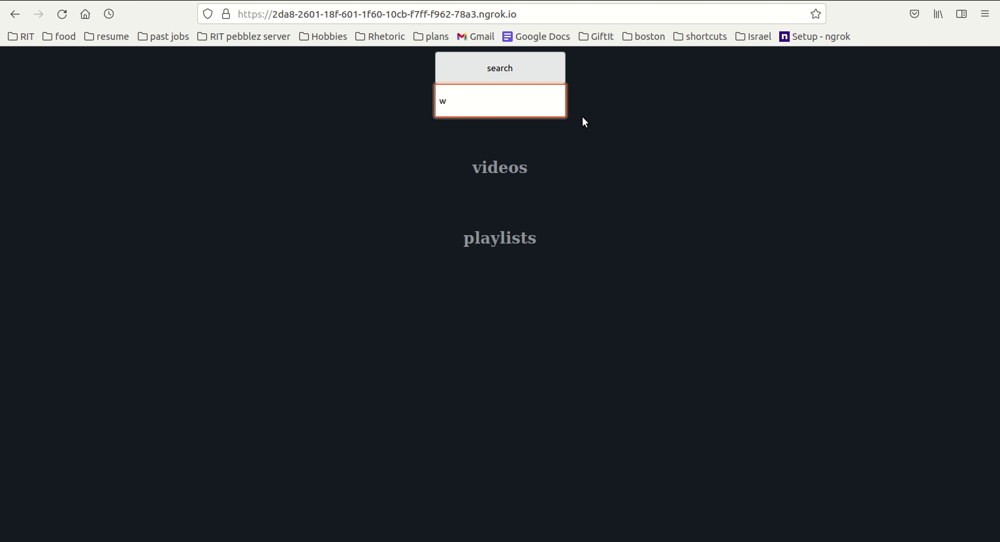

# No ad youtube
<p align="center">

</p>
This project is a proof of concept that explores the use of youtube's embed architecture to circumvent ads

## Quickstart
```
git clone https://github.com/BarakBinyamin/addless-youtube.git
cd addless-youtube
npm install
node index.js --port=8000
```

## Also Ngrok
Forward this service to the web using ngrok, and avoid being canceled by youtube for not having a domain name
1. [Make an ngrok account](https://ngrok.com/)
2. Create an ssh key with the command `ssh-keygen`
   1. Follow the prompts, remember the passphrase 
   2. Copy the public key (cat /path/to/id_rsa.pub)
3. [Paste the ssh key to ngrok](https://dashboard.ngrok.com/tunnels/ssh-keys)
4. Forward this service to the web
```bash
ssh -i id_rsa -R 443:localhost:8000 tunnel.us.ngrok.com http
```
The output should be two routes, one with ssl enabled
